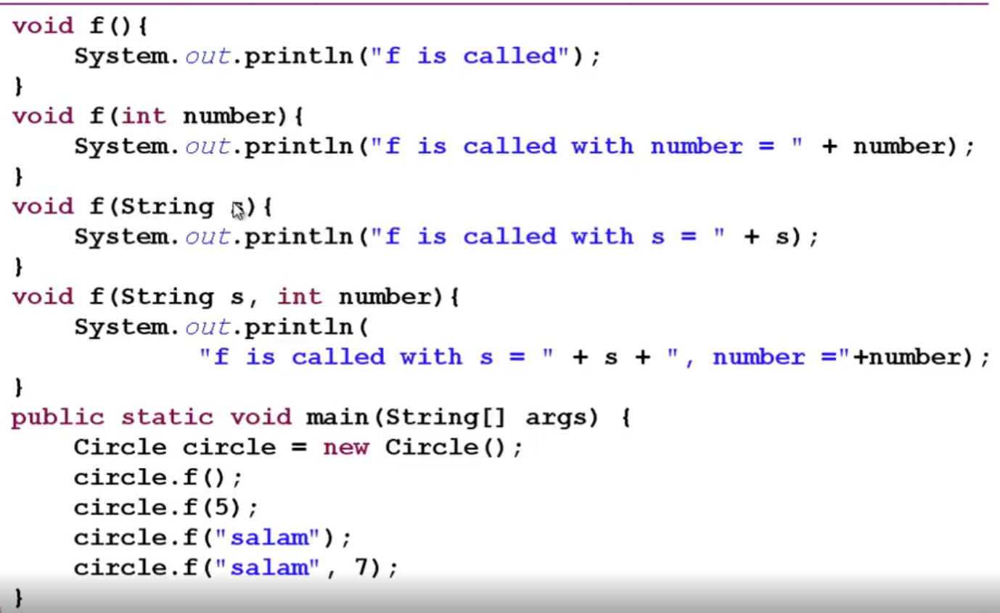

# JAVA
Java is a high-level, class-based, object-oriented programming language that is designed to have as few implementation dependencies as possible. It is a general-purpose programming language intended to let programmers write once, run anywhere (WORA),[16] meaning that compiled Java code can run on all platforms that support Java without the need to recompile.[17] Java applications are typically compiled to bytecode that can run on any Java virtual machine (JVM) regardless of the underlying computer architecture. The syntax of Java is similar to C and C++, but has fewer low-level facilities than either of them. The Java runtime provides dynamic capabilities (such as reflection and runtime code modification) that are typically not available in traditional compiled languages.# what is java?
java is a simple langauage

High-level-language ---> assembly language ---> machin language<0,1> ---> HardWare


# list of the java
1) serverSide --> JAVA Standard/Enterprise Edition.(JAVA SE,EE)
2) java Android.
3) Electronic devices --> java Micro Edition.
4) java Card

# JDK
java Develop ket ==> that allow us to compile the java code.
jvm is on it.
## JVM Architecture
JVM(Java Virtual Machine) runs Java applications as a run-time engine. JVM is the one that calls the main method present in a Java code. JVM is a part of JRE(Java Runtime Environment).

Java applications are called WORA (Write Once Run Anywhere). This means a programmer can develop Java code on one system and expect it to run on any other Java-enabled system without any adjustment. This is all possible because of JVM.

When we compile a .java file, .class files(contains byte-code) with the same class names present in .java file are generated by the Java compiler. This .class file goes into various steps when we run it. These steps together describe the whole JVM. 
all code jave run by this.

1) jvm --> os --> hardware
2) java.code.java ---> JAVAC(java compiler) ---> Byte Code (.class) (interpreted)---> JAVM(machineCode)

* c++ run on os directly
* c# run on .net

## JRE
a part bit onJDK that just run JAVA compile

# Bytecode

Bytecode is computer object code that an interpreter converts into binary machine code so it can be read by a computer's hardware processor. The interpreter is typically implemented as a virtual machine (VM) that translates the bytecode for the target platform. The machine code consists of a set of instructions that the processor understands.
c++ =< system program  low-level programming.>=> code ---> Compile
java =software development or web-based application development==>
code --> JAVAC<javaCompiler> --> ByteCode<.class> JVM<classLoader,ByteCodeVerifier,JITCompiler> --> native Machine Code<001101>

bit --> byte --> character --> word
# mean
1) platform Independence --> write a programmer that run in all envirement.
2) cross-platform 
3) portable --> transform a programing and run to a lot os.
4) Architecture Neutral
5) Write Once Run Anywhere

# Code
## First
```
    public class <nameFile>{
         public static void main(String[] args) {
        System.out.println("salam!!!");
    }
    }
    ### 1) Compile it with javac ==> java.class
    ### 2) Run java with java


    java ---> .class ---> .class Run on JVM
```

# type
## PRIMITIVE TYPES
1) char
2) boolean

### NUMBER
1) byte
2) short
3) int 
4) long
#### Floating-Point Types
1) float
2) double
%.1f ==> just show 3.1415 ==> 3.1
### chnage Type

1) byte can be change to short,int,long.float,double.
2) short ==> int,long,float,double.

### type casting
int intVal  == longval ==> error
lonval == intval ==> OK
int intVal == (int) longVal ==> OK (type casting)

### STRING
save a collection of char.
```
 String st = "Ahay Salam Ahay Salma!!!";
 charAt(0)==> A; 
 indexOf("Salam") ==> 5;
 lastIndexOf("Salam") ==> 16
 replace ==> "salam","chishod"
 substring ==> 1,3
 length
 equals
 equalsIgnoewCase
 concat ==> a + b ==> ab;
 contains ==> "salam" true

 \n ==> next line
 \t ==> tab

```
### ARRAY
``` 
    char[] array = {'a','s','t'};
    int[] array = new int[4];
    int array[] = new int[25];
    int [][] matrix = new int[3][4]
    matrix[2][3] = 2;
    for(int n: array){}
```

### REFRENCE TYPES
ref to an object

1) object

### PRIMITIVE_REFRENCE_IN_MEMORY


store in the Heap
1) ref -->cell --> value ==> s=t ==> s ref to cell t
2) primitive --> value ==> copy the value in new cell
```
    method(first,seccond,number)
    {
        <!-- now there new persion.age too change to 12, because they are ref in a pointer just cell is different not value  -->
        first.age = 12
        <!-- there myInt not change because primitive type do not ref and just copy in a cell -->
        number = 56
        <!-- there is not chnage the value on new Pesrion2 just on seccond beacue it ref on new object and last onject const on the memry -->
        seccond = new Persopn() 


    }

    call => method(new persopn,new Pesrion2,myInt)

    <!-- 2 -->
    m1(int x,Student t)
        x = 13
        t.name = "heshmat"

    int a = 12
    m1(a)
    print a ==> 12 beacuse it is primitive type and x copu on an other cell of memory if it was reference type change the value
    m1(new studned.name = amir)
    prit studned.name ==> heshmat becace ref type chnage the parameyrt

    new int[] ===> it is array that refrenxtype
    t(int a[])
        a = 909
        a= new int[] ==> there a ref to new onject and do not any effiect on an other object
    a= new int[12];
    a[2] = 90
    t(a) ==> 909
    print(a)


    

    

```
### 
call by value ---> primitive
call by pointer --> send Object like String
call refernce ---> 

## MEMORY(RAM)
1) HEAP
* OBJECT that value and not ref that ref store in stack
* garbage collector just is in there
2) STACK
* PRIMITIVE TYPE
* ref the Object 
* after use a vaivable it delete automaticly from ram and is all of the langages 

### JVM(MEMEORY)
1) -Xms ==> heap noramal size
2) -Xmx ==> heap incress size
3) -Xss ==> stack incress size

* java -Xms512m -Xmx3750m Person
* java -Xss4m Test
* java -Xmx3750m -Xss4m Main  
* if new alot ==> Error java heap space ,if in function we don not braek; ==> StackOverflow Error


### FINALIZE
1) Garbage Collection just Delete the Meomey somtimes an aobject get a lot of source withou RAM like file , db ,... garabge collection can not remove them and we have to remove them with this method.
```
 private voide finalize() {
    System.oit.println();
 }
 System.gc();
```
2) it is good for print log

## constructor
when an object create it create automaticly and it ready the object for the use
A constructor in Java is a special method that is used to initialize objects. The constructor is called when an object of a class is created. It can be used to set initial values for object attributes:
## Block
it is use when we want to use that we do not have any paramert tht ppass to the objec and if we have any parametr we can use constructor


# package
* include some file
* *ach package just has one public class that should equals with the name class
an othe can not have publixc void main and with and name in class and floder
java.util.sannder
‍‍‍‍‍``
    import java.util.Scanner
    java.lang
        - lang.String
        - lang.Math
    java.util
        - java.util.Scanner
        - java.util.Arrays   
    ** all package in java.lang is uses automaticly.    
`` 

# package access


1) public ==> just use java.*
2) private just use in package and class
3) not private and no public ==> java.u.p just that class are in the same packeage java.ir.oop both file should exit on there
4) protected ==> just the class that Inheritance on this can just access
# Static
* that is a property for a class not an object like in a class year or length is same for all product in all object is same
* a static just has a cell in memeory
* without create an object we can use a static valriable very easily.
* if an object not static it when it create it has a cell in memeory with create each new object
* is static method just we can use that property is static or method static
* static just do operation not behavir
``
    # line
    public static int MAX_AGE = 84;
    static String  name = theDefaultName() // the method is static so it hae to static
    private static String theDefaultName() {
        return "afshin"
    }
    # static Block
    stati String Name;
    static int MAX_AGE
    static{
        MAX_AGE = 90;
        Name = "afshin"
    }
``
# pointe
* when a class called ,part of jvm with classLoader load this class  and give some part (initialize)

* each time when we call new an object:0) one time create static line and block  1) line value ; 2) instance initialization block; 3) constructor 

* garabge collector can not delete static 
``
System.gc()
Thread.sleep(1000)
``


# singleton
we create one time object and all the time we use it when call from the memory
``
    public class Singleton {
        private static singleton instance = new Singleton();
        // constructor is private and just in this class just can create
        private Singleton () {}

        public static Singleton getInstance() {
            return instance
        }
    }
``
# Inheritance(IS_A)
* good for reuse abel
* child class can not delete a property from super class
## Override
* change a behavior in child class and it is different on super class
* In Override we can not chnage the acess ==> public != private
### annotation
* int start with `@` like `@Override`
* Metadata ---> descaribe a method or class
``
class Animal {
    public void talk(){}
}
class Dog extends Animal {
    private string name
    @Override
    public String toString() {
        return name
    }
    @Override
    public void talk() {
        
    }
}
``
## overload
* we difine the same name method but with diffirent parameter
‍‍‍‍‍``
int f() {}
int f(int a) 
``

##  varargs;
* if we have a method that has a lot of paramert we  can describe like this:
``
// there we can print ziro or many string
void print(String... args) {...}.

print();
print("afshin");
print("a","b","c");

``
``
static void print(String... params) {
    String[] array = param
}
``

# PRIMITIVE WRAPPER CLASSES
* when we need a primitive type that work like object we use primitive rapper class
1) Byte
2) short
3) Integer
4) Long
5) Float
6) Double
7) Character
8) Boolean.

``
Double n = new Double(12.2);
n.doubleValue();
n.intValue();
n.MAX_VALUE;

Integer a = new Integer(12);
``
* autoboxing:
Integer i = 2; // insetead of new Integer();
* unboxing:
int a = new Integer(2);

# Method Overloading


* in a class we have a lot of same name method but with different parameter.

# equals
* it is good for  Object
* return boolean


# final Variable
* constanct == final
``
final int a = 90;
``

# Mutable & Immutable
Mutable
those objects that can be cahange the Variable ,....
* has setter
* has method for set value
* change state
Immutable
* it is for object some object Mutable and some of them are Immutable
* final !== Immutable<state>
* + Immutable are easily to understood
* + Thread-safe
* all PRIMITIVE WRAPPER CLASSES are 

# enum(enumeration)

``
enum Color {
    BLACK,RED
};
Color.values();
``
# pointe
* when a class called ,part of jvm with classLoader load this class  and give some part (initialize)

* each time when we call new an object:0) one time create static line and block  1) line value ; 2) instance initialization block; 3) constructor 

* garabge collector can not delete static 
``
System.gc()
Thread.sleep(1000)
``
* if we have an object (s = new car) and log the s ==> this object automaticaly called toString method.
* 
‍‍‍``
// can not accept null if we want it is optional and it full auto 0;
private int age;
// fot handle null we can use class wrapped;
private Integer age = null;
``
* if we write a final we have to full it in block or constructor


# JAR (Java Archive)
jar cf <name> <name file class>
* it is look .zip but for java.
* a place that we can hold the java class.
* JAR include .class.
# Classpath(CP)
* aprameter on JVM

# javadoc
* write document in java.
``
/** 
* this class in good
* @author afshin Rahmati.
* @see java.lang.String
/** 
* that is test 
* @param id the number
* @retun return 
*/
``

# super and this


* super is for parent
* this just in methode
* all class in java extends fron object by defualt
``
toString
finalize
equals
hashCode
all of them are in iObjce
``
# Composition<has a> 
* it is better than 
* it is different with is a< extenct>
``
class Human {
    use a classs
    private heart;
    privaet leftHand
    private rightHand
}
``
## Association
## Aggregation


# Interface

* it is look like abstrac class
* with tis we can multiple Inheritance of Bhavior

``
public interface Shape {
    int getAtrea();
    String getName 

}
impements
``
## what is different between abstrac and interface?


# Inner Classes


* it can be final if it is final can not extend